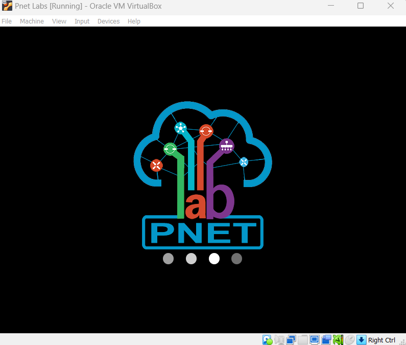

PNET SETUP
```html
PNET LAB SETUP AND Integration of devices
```

1. Download the pnet image from the official pnet website [pnet image](https://pnetlab.com/pages/download)
2. Download virtualbox from the official site.
3. import the pnet image to virtualbox

5. update pnet to the latest version 5.3.11 use winscp sftp to trnsfer the file to the machine from your local machine